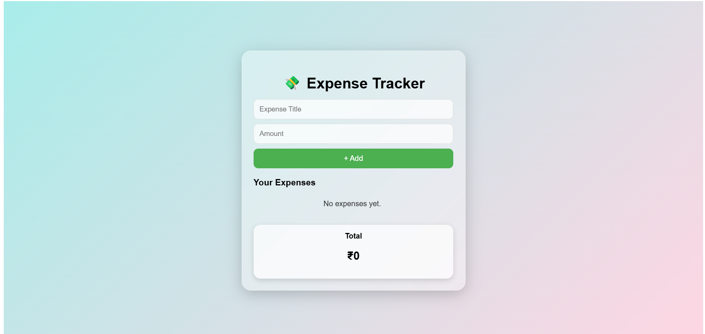
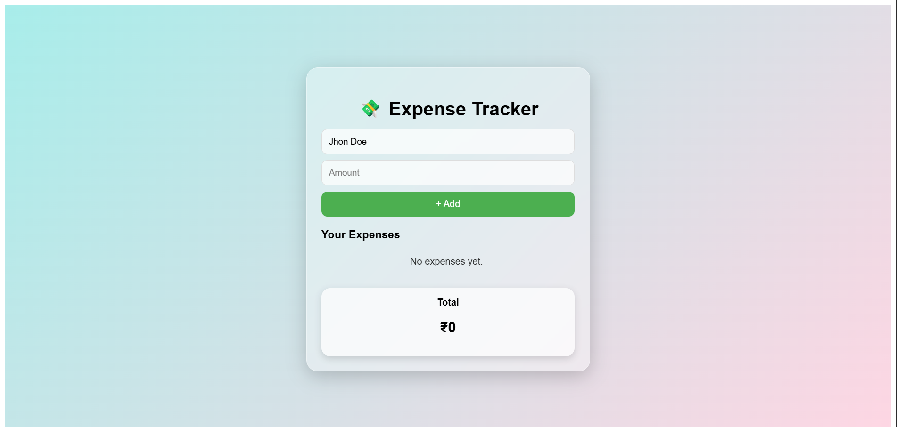
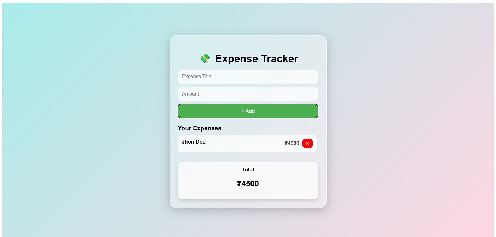
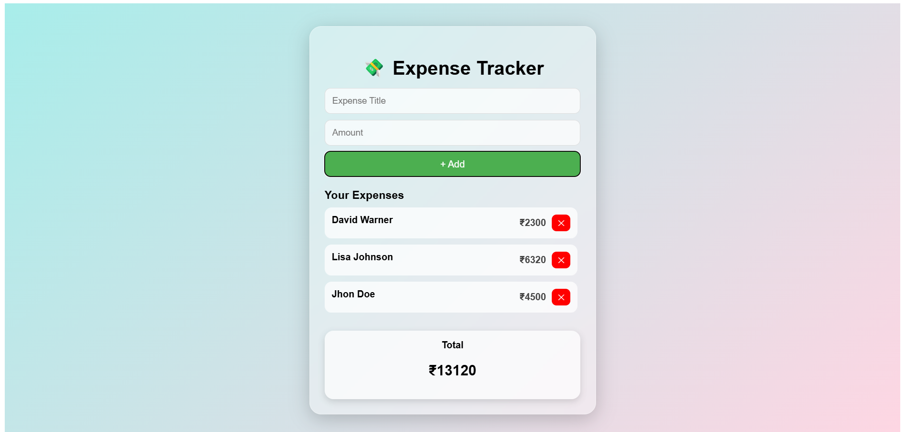
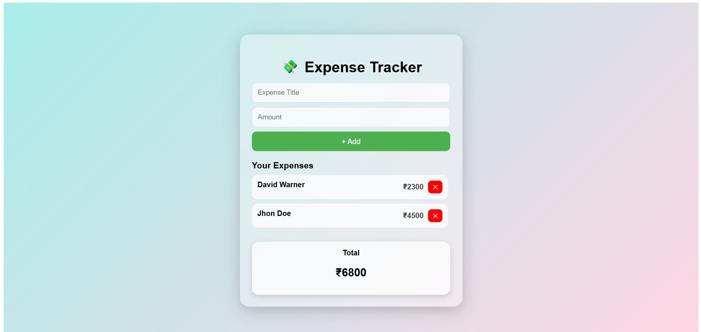

**Main Page**

**Add Expanse Title**

**Add Amount**

**Click on Add button and see your expanses list**

**Add another expanses**

**Click on delete button to delete expanse**

## Expense Tracker UI

A simple and beautiful Expense Tracker built using React, covering concepts of State, Forms, and UI rendering.
Users can add, remove expenses and see the total amount update in real time.

**Features**

- Add new expenses
- Delete existing expenses
- Auto-calculated total expense
- Managed using React useState
- Clean & modern UI
- Fully responsive layout

**Technologies Used**

React (Vite)
JavaScript (ES6)
CSS
useState Hook

**Project Structure**

expense-tracker/
│
├── src/
│   ├── App.jsx│   ├── App.css│   ├── main.jsx│   └── assets/
│
├── index.html├── package.json└── README.md 

**Installation & Setup**

1️⃣ Create a new React project using Vite

npm create vite@latest expense-tracker -- --template react

2️⃣ Move into the project

cd expense-tracker

3️⃣ Install dependencies

npm install

4️⃣ Start development server

npm run dev

Your project will run at:
 http://localhost:5173/

**How to Use**

- Enter an expense title
- Enter an amount
- Click Add Expense
- See the item appear in the list
- The Total updates automatically
- Click Delete to remove any expense

**Concepts Covered**

- React Components
- React State Management
- Handling Forms & Inputs
- Dynamic List Rendering
- Passing functions & updating UI

